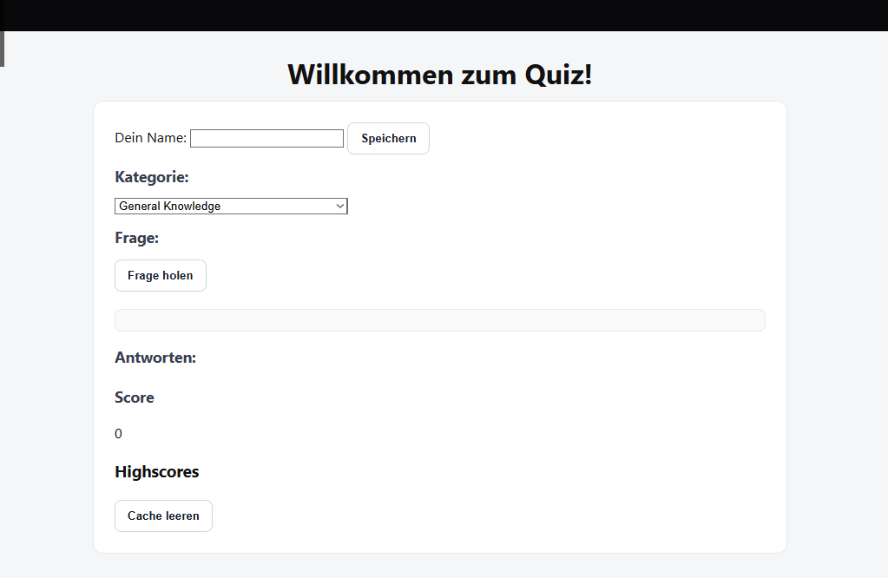

# Protokoll: Open Trivia Protokoll
## Weghuber Christoph 

## Screenshot der UI

### 1. HTML-Struktur
- Grundgerüst mit Header und Main-Bereich.  
- Eingabefeld für Spielername mit Speichern-Button.  
- Auswahlfeld für Kategorie (gefüllt durch API).  
- Anzeige der Frage und Antwortmöglichkeiten.  
- Anzeige von Score und Highscore-Liste.  
- Button zum Leeren des Caches.  

### 2. CSS-Layout
- Minimalistisches, responsives Layout.  
- Gestaltung von Header, Buttons und Antwort-Grid.  
- Hervorhebung von Buttons bei Hover und Fokus.  
- Antworten werden in einem flexiblen Grid angezeigt.  
- Mithilfe von KI generiert

### 3. JavaScript-Funktionalität

- **Spielername**:
  - Speicherung im Local Storage.  
  - Validierung (kein leerer Name).  
  - Reset des Scores bei neuem Namen.  

- **Highscore-System**:
  - Speicherung im Local Storage.  
  - Sortierung nach Score (absteigend).  
  - Dynamische Darstellung als Liste.  

- **Fragen & Antworten**:
  - Abruf über Trivia-API mit Kategorie.  
  - Mischen von Antworten.  
  - Buttons für jede Antwort.  
  - Prüfung, ob Antwort richtig oder falsch ist.  
  - Anpassung von Score + farbliche Hervorhebung.  

- **Cache-Funktion**:
  - Löscht Spielernamen und Highscores aus Local Storage.  
  - Setzt Score zurück.  

## Ergebnisse
- Funktionsfähige Quiz-Anwendung mit API-Anbindung.  
- Persistente Speicherung von Spielernamen und Highscores.  
- Klare Trennung von Layout (CSS), Struktur (HTML) und Logik (JS).  

## Nächste Schritte
- Erweiterung um Schwierigkeitsgrade.  
- Anzeige von richtig/falsch direkt nach Klick (Feedback optimieren).  
- Responsives Design für Smartphones verbessern.  
- Möglichkeit für Mehrspieler-Modus hinzufügen.  

---
