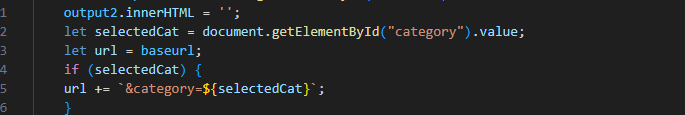

# Protokoll: Open Trivia Protokoll
## Weghuber Christoph 5AKIF

## Screenshot der UI

### 1. HTML-Struktur
- Grundgerüst mit Header und Main-Bereich.  
- Eingabefeld für Spielername mit Speichern-Button.  
- Auswahlfeld für Kategorie (gefüllt durch API).  
- Anzeige der Frage und Antwortmöglichkeiten.  
- Anzeige von Score und Highscore-Liste.  
- Button zum Leeren des Caches.  

### 2. CSS-Layout
- Minimalistisches, responsives Layout.  
- Gestaltung von Header, Buttons und Antwort-Grid.  
- Hervorhebung von Buttons bei Hover und Fokus.  
- Antworten werden in einem flexiblen Grid angezeigt.  
- Mithilfe von KI generiert

### 3. JavaScript-Funktionalität
- Der Code ist durchkommentiert aber ich werde hier die wichtigsten Stellen nochmals per Screenshot nehemen und erklaeren.
#### **Name**

- Speichern-Button startet die Funktion.
- Prüfung: Wenn Feld leer → Warnung + Abbruch.
- Sonst: Name in localStorage, Score auf 0, Anzeige aktualisieren, Bestätigung zeigen.

#### **Kategorie**

- API-Aufruf (fetch(categoryUrl)) holt die verfügbaren Kategorien.
- Zuerst wird eine Option Alle Kategorien erstellt und ins Select eingefügt.
- Danach wird für jede Kategorie aus den API-Daten ein Option-Element erzeugt (mit id als Wert und Name als Text) und hinzugefügt.
- Standardmäßig wird die Kategorie 9 (Allgemeinwissen) ausgewählt, wie in der Extension gefordert.
- Später beim Fragenholen: die ausgewählte Kategorie wird an die API-URL angehängt (&category=...)

#### **Frage&Antworten**

- Die App holt sich mit fetch(url) eine neue Frage von der API und zeigt den Text an.
- Dann werden die richtigen und falschen Antworten zusammengeworfen und sort(() => Math.random() - 0.5) sorgt dafür, dass die Reihenfolge der Antworten jedes Mal zufällig gemischt wird, damit die richtige Antwort nicht immer an derselben Stelle steht.
- Für jede Antwort wird ein eigener Button gebaut.
- Klickst du auf einen Button:
- Wenn’s die richtige Antwort ist → dein Punktestand steigt, der Button wird grün markiert.
- Wenn’s falsch ist → der Button wird rot, und zusätzlich wird die richtige Antwort automatisch grün angezeigt.

#### **Highscore Liste**

- getHighscores(): Holt die gespeicherten Highscores aus dem Browser-Speicher (localStorage).
- getScoreForPlayer(name): Sucht nach dem Score von einem bestimmten Spieler in dieser Liste.
- setScoreForPlayer(name, score):
- Holt erstmal die aktuelle Highscore-Liste.
- Schmeißt den alten Eintrag des Spielers raus (falls schon vorhanden).
- Fügt den neuen Eintrag mit aktuellem Punktestand hinzu.
- Speichert die Liste wieder zurück in den Speicher.

#### **Probleme**
- Ich habe zuerst nicht ganz das mit der Kategorie versatnden vor allem die Stelle wo man es an die API URL anhaengen muss da hatte ich viele Probleme es zu implementieren und vor allem auch wo im code es zu implementieren. 
- Die Highscore Liste hat auch viele Probleme gemacht vor allem das im Zusammenhang mit den Namen ein Beispiel war das ich zu loesen hatte war dass ein Spieler nach jedem Punkt als neuer Eintrag in der Highscore-Liste landet, also Anna2,Anna3,Anna4
Die Lösung ist, vor dem push erstmal alle alten Einträge des Spielers rauszufiltern, z. B. mit etwas wie filter(e => e.name !== name). 