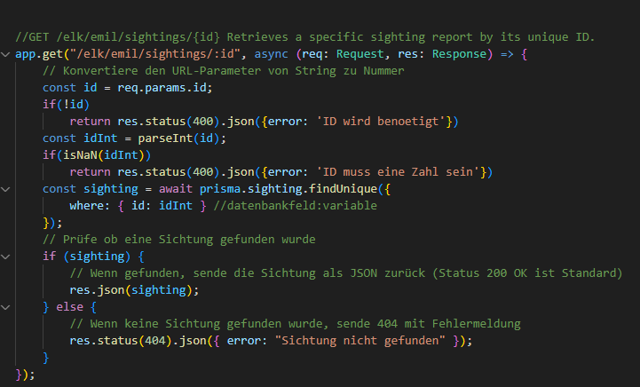
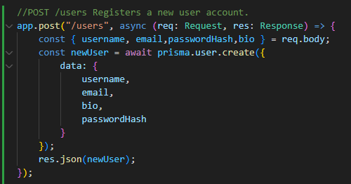
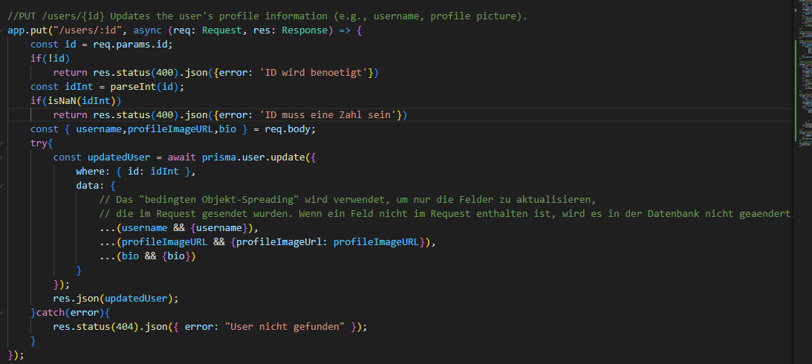

# Protokoll: Emil BackendPoints
## Weghuber Christoph 5AKIF

- Ich habe jeweils eine der komplexen Operationen genommen und erklärt, damit alle verwendeten Konzepte verständlich sind. Außerdem habe ich den Code zusätzlich kommentiert, um ihn  verständlich zu machen.

## GET

- Ich habe eine GET-Route "/elk/emil/sightings/:id" definiert, die genau eine Sichtung per eindeutiger ID zurückgibt. Beim Aufruf (z. B. /elk/emil/sightings/42) lese ich die ID aus req.params.id – sie kommt immer als String. Fehlt sie, antworte ich sofort mit HTTP 400 und einer Fehlermeldung („ID wird benötigt“).
- Als Nächstes wandle ich den String mit parseInt in eine Zahl um und prüfe mit isNaN(idInt), ob die Konvertierung gelungen ist. Ist die ID keine gültige Zahl, breche ich erneut mit 400 ab („ID muss eine Zahl sein“).
Ist die ID valide, frage ich die Datenbank über Prisma ab: prisma.sighting.findUnique({ where: { id: idInt } }). Das setzt voraus, dass es ein Prisma-Model sighting gibt und das Feld id dort unique ist. Das await pausiert den Handler, bis Prisma antwortet.

## POST

- In diesem Code habe ich eine POST-Route unter /users definiert, über die neue Benutzer registriert werden können. Aus dem Request-Body lese ich die Felder username, email, passwordHash und bio aus und übergebe sie an Prisma, um damit einen neuen Datensatz in der user-Tabelle zu erstellen. Sobald der Benutzer erfolgreich angelegt wurde, sende ich das erstellte Benutzerobjekt als JSON-Antwort zurück.“

## PUT 

- In diesem Code habe ich eine PUT-Route /users/:id erstellt, mit der die Profilinformationen eines Benutzers (z. B. username, bio oder profileImageURL) aktualisiert werden können. Zuerst wird die ID aus req.params.id ausgelesen. Wenn sie fehlt, sende ich eine 400-Fehlermeldung („ID wird benötigt“). Danach konvertiere ich die ID mit parseInt in eine Zahl und prüfe mit isNaN, ob sie gültig ist – falls nicht, kommt wieder eine 400-Antwort („ID muss eine Zahl sein“).
- Wenn die ID korrekt ist, lese ich die Felder username, profileImageURL und bio aus dem Request-Body. In einem try-Block wird dann mit Prisma der entsprechende Datensatz in der Datenbank aktualisiert. Das passiert mit prisma.user.update, wobei im data-Objekt nur die Felder gesetzt werden, die tatsächlich im Request enthalten sind. Dafür wird sogenanntes bedingtes Objekt-Spreading verwendet – das heißt: nur wenn z. B. username existiert, wird { username } in das Objekt übernommen. So werden keine leeren oder fehlenden Werte überschrieben.

