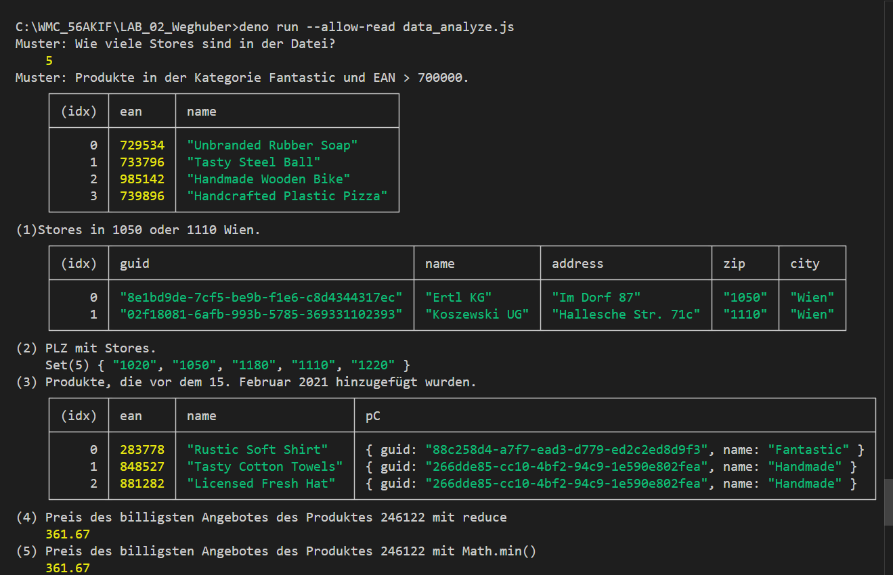
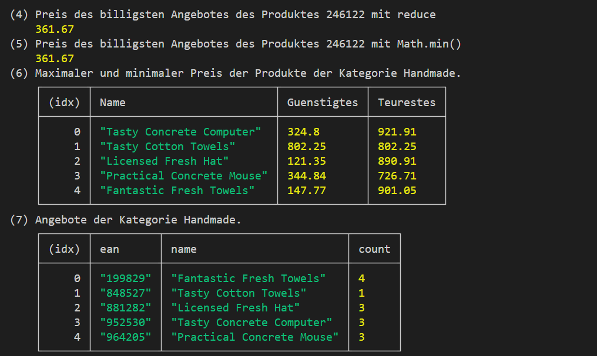
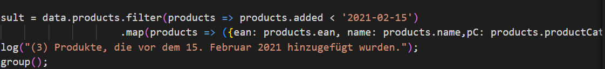
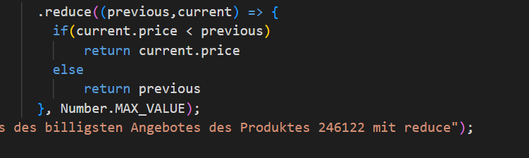
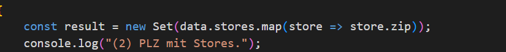
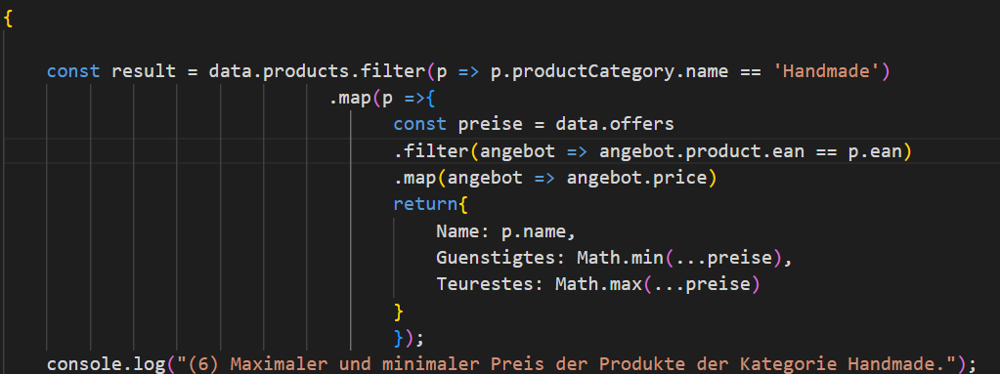
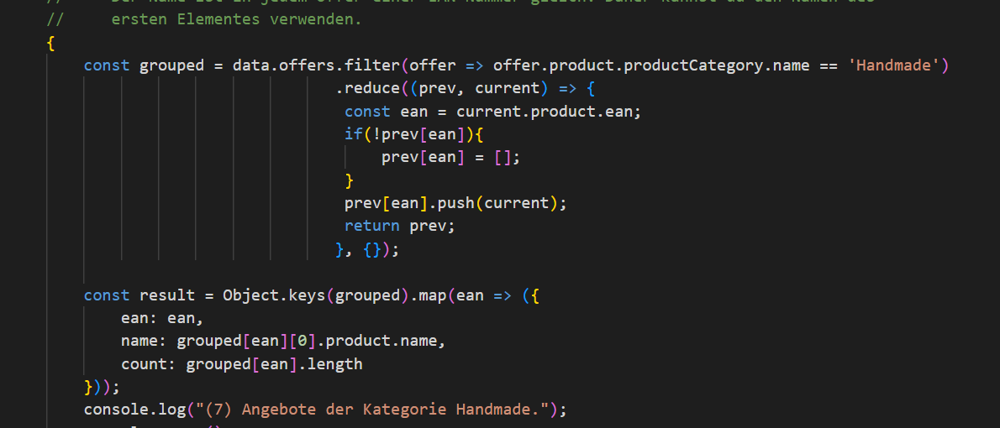

# Protokoll: Array Methoden
## Weghuber Christoph 5AKIF

## Screenshot der Ausgabe

## Filter

- Prüft für jeden store die Bedingung.
- Nimmt nur Stores, deren zip(Postleitzahl) 1050 oder 1110 ist.
- result enthält nur diese Stores, data.stores bleibt wie es ist.
- Filter löscht nichts im Original, er kopiert passende Elemente.
- Wahr/Falsch-Entscheidung: Alles, was nicht truthy ist (false, 0, "", null, undefined, NaN), gilt als durchgefallen.
## Map 

- Rückgabe: Neues Array mit den transformierten Werten.
- Das Original-Array bleibt unverändert.
- 1:1: Für jedes Eingabeelement genau ein Ausgabeelement.
- in dem Fall map ich für die ausgabe die namen die in der Tabelle stehenn sollen
## Reduce

- Startwert Number.MAX_VALUE = sehr groß → erster echte Preis wird kleiner sein.
- Vergleich: Wenn der aktuelle Preis (current.price) kleiner ist als der bisherige Minimalwert (previous), nimm current.price,sonst behalte previous.“
- Ergebnis: der kleinste Preis im Array.
- Leere Arrays: Ohne Startwert crasht reduce bei []. Mit Startwert bekommst du sinnvoll definierte Defaults (hier Number.MAX_VALUE).
- Typen beachten: Wenn price Strings sein könnten → vorher casten: Number(current.price).
## Set

- Kein Duplikat: Jeder Wert kann nur einmal drin sein.
- Reihenfolge: Behält die Einfüge-Reihenfolge beim Iterieren.
- Typen: Kann beliebige Werte halten (Zahlen, Strings, Objekte).
- Bei Objekten zählt die Referenz – gleiche Inhalte ≠ gleiches Objekt.
## Special 6

- Filtern der Produkte: Aus data.products werden nur die Produkte mit productCategory.name === 'Handmade' genommen.
- Pro Produkt Preise sammeln & auswerten: Für jedes Handmade-Produkt werden in data.offers alle passenden Offers (hier per Ean gematcht) gefiltert, daraus die price-Werte extrahiert und anschließend Minimal- und Maximalpreis mit Math.min(...preise) bzw. Math.max(...preise) berechnet.
- Ergebnis formen: Zurückgegeben wird je Produkt ein Objekt { Name, Guenstigstes, Teuerstes }, das in result landet.
## Special 7

- Filtern: data.offers.filter(...) lässt nur Offers durch, deren offer.product.productCategory.name === 'Handmade' ist – also nur Handmade-Angebote.
- Gruppieren per reduce: Start mit {} als Akkumulator. Für jedes Offer wird die EAN als Key genommen (const ean = current.product.ean). Falls prev[ean] noch fehlt, wird es als leeres Array angelegt, danach das Offer hineingepusht. Ergebnis: ein Objekt grouped der Form { [ean]: Offer[] }.
- Projizieren: Object.keys(grouped).map(...) baut aus jeder EAN-Gruppe ein Ausgabeobjekt:
- ean: der Key selbst,
- name: vom ersten Offer der Gruppe (grouped[ean][0].product.name),
- count: Anzahl der Offers (grouped[ean].length).
